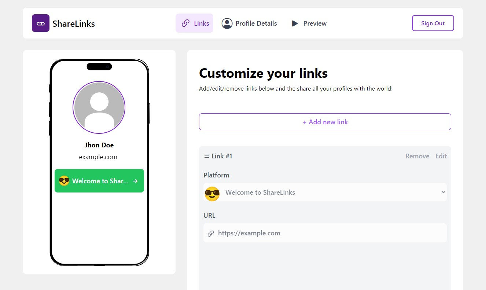
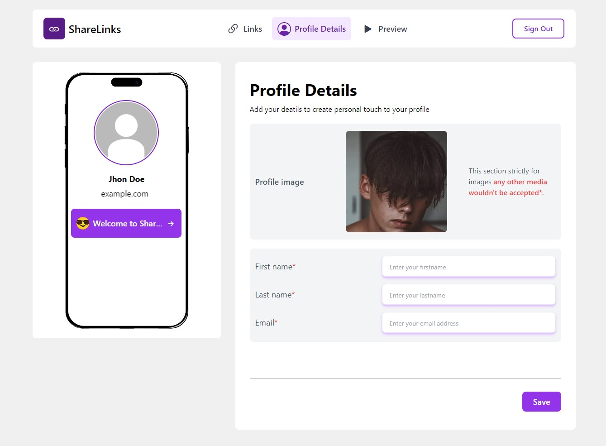
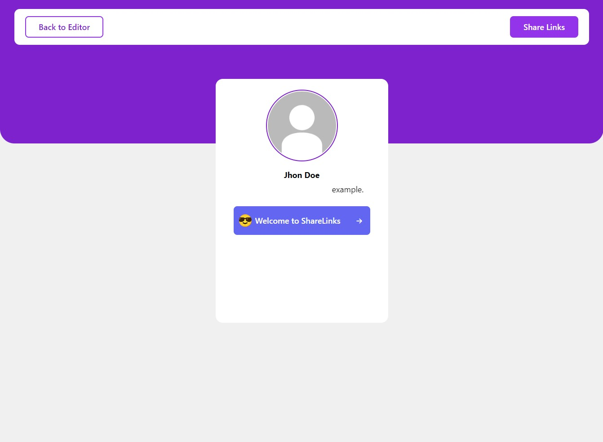
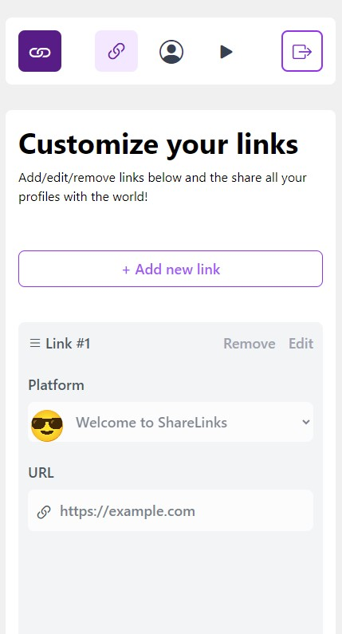
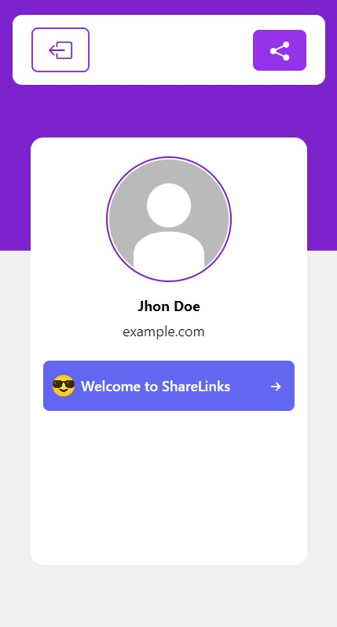

# ShareLinks

**ShareLink!** Easy way to share important links and save them.

## Table of Contents

- [Introduction](#introduction)

- [Screenshots](#screenshots)

- [Installation](#installation)

- [Usage](#usage)

- [Technologies Used](#technologies-used)

- [Features](#features)

- [Contributing](#contributing)

## Introduction

Easily share and manage your favorite links across multiple platforms with ShareLinks. This application provides features like adding new links by just inputting a URL, editing the URL, having a profile (images, name, and email), and the ability to share those links. The application scrapes important data off the provided URL.

## Screenshots







## Installation

Go to your terminal and run the following guidelines:

1. Clone the repository:

   ```bash
   git clone https://github.com/omotosodavid/sharelinks.git
   ```

2. Navigate to the project directory:

   ```bash
   cd sharelinks
   ```

3. Install dependencies:

   ```bash
   npm install
   ```

4. Start the development server:

   ```bash
   npm start
   ```

5. Open your web browser and access the application at [http://localhost:3000](http://localhost:3000).

**Note:** After cloning and wanting to use it locally, take note of `useFunction.jsx` and `useInput.jsx`. There are some scraping functions where I used Axios to fetch data from a URL. You would need to clone this repository [OpenGraphAndAuthForShareLink](https://github.com/omotosodavid/OpenGraphAndAuthForShareLink.git) for the backend. On `Page.jsx`, where I used SuperTokens for authentication, if you don't want authentication, you can remove it or configure it to your taste. Check [SuperTokens](https://supertokens.com) for more information. Make sure to change the `apiDomain` to the URL of your backend and the `websiteDomain` to `http://localhost:3000`.

## Usage

- **Home Page:** Displays a phone component (not visible for mobile users) where the user profile (image, name, and email) is displayed along with a list of added links. There's also a section to add/edit/remove links.

- **Profile Page:** Displays a phone component (not visible for mobile users) where the user profile (image, name, and email) is displayed and enables users to add profile details such as their image, name, and email.

- **Preview Page:** Displays the user profile (image, name, and email) and list of added links. This component provides the ability to share the stored links on various platforms.

## Technologies Used

- **React.js:** JavaScript library for building user interfaces efficiently with reusable components.

- **React Router-Dom:** Library for dynamic routing in React applications, enabling navigation between different views.

- **React-Helmet:** Library for managing the head section of React applications, allowing updates to meta tags.

- **Axios:** Promise-based HTTP client for making API requests from the browser.

- **SuperTokens:** Library for implementing secure authentication and session management in web applications.

- **Tailwind CSS:** Utility-first CSS framework for designing responsive and customizable UI components.

- **Bootstrap Icons:** Free and high-quality open-source icon library with over 1,800 icons.

- **REST API:** Used for structured communication between the frontend and backend.

- **Firebase (Firestore):** NoSQL cloud database for storing and syncing data in real-time across devices and users.

## Features

- CRUD (Create, Read, Update, and Delete) features

- Add Links

- Edit Links

- Delete Links

- Display Links with a means to visit those links

- Add profile details

- Share links

- Save Links

- Responsive design for various screen sizes

## Contributing

Contributions are always welcomed! If you find any issues or have suggestions for improvements, feel free to open an issue or submit a pull request.
